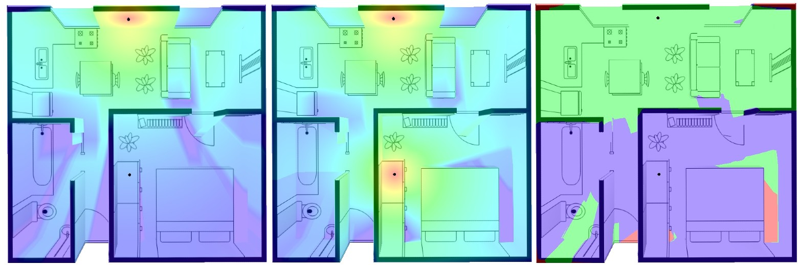

# 3D Coverage Heatmap

Our project accurately simulates signal decay through obstacles, providing intensity estimates at each point. With support for real-time computation on mobile devices and easily extendable modules for complex scenarios, it offers a comprehensive toolkit for exploring signal transmission dynamics.



# Quick start

## Development Environment Setup

```
yarn
yarn dev
```

## Build

```
yarn build
```

# References

- [ray-aabb intersection](https://gist.github.com/DomNomNom/46bb1ce47f68d255fd5d)
- [ray-triangle intersection](https://stackoverflow.com/questions/59257678/intersect-a-ray-with-a-triangle-in-glsl-c)
