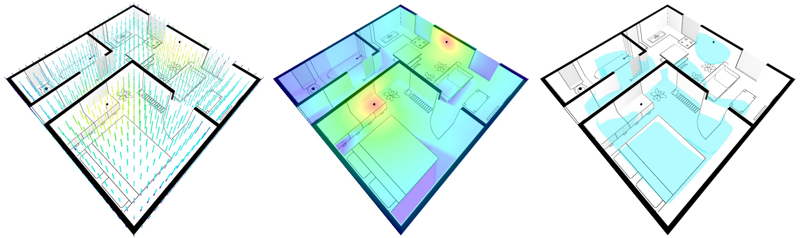

# 3D Coverage Heatmap

Our project demonstrates the functionality of signal decay simulation through obstacles, providing intensity estimates at various points for visualization purposes. It supports real-time computation on mobile devices and features easily extendable modules for exploring complex scenarios. Note that while the intensity values are used for visualization, they do not reflect real-world signal behavior.



# Quick start

## Development Environment Setup

```
yarn
yarn dev
```

## Build

```
yarn build
```

# Implementation Details

For each fragment $i$, we perform raycasting $R_{i,j}$ from signal $j$, computing intersections with axis-aligned bounding boxes (AABBs) and triangles to separate into airborne ${A_{i,j}}$ and obstacle ${O_{i,j}}$ components.

Next, we calculate the signal intensity $𝑆_{fragment_i}$ of the fragment using two decay functions: $decay(S,D)$, which considers the original signal intensity $S_j$ and the airborne distance $length({A}_{i,j})$. and $attenuation(AABBs,Triangles,L)$, which accounts for spatial obstacles such as AABBs and triangles along the ray's path through the solid object.

$Decay_{i,j} = {decay}(S_{j}, length({A}_{i,j}))$

$Attenuation_{i,j} = \sum_{k} \ attenuation(AABB_k,Triangle_k,length(O_{i,j}))$

$S_{fragment_i} = \max_j (Decay_{i,j}-Attenuation_{i,j})$

For further details, you can read the source code of the [fragmenet shader](./packages/three-coverage-heatmap/src/Material/HeatmapMaterial/fragmentShader.js).

# References

- [ray-aabb intersection](https://gist.github.com/DomNomNom/46bb1ce47f68d255fd5d)
- [ray-triangle intersection](https://stackoverflow.com/questions/59257678/intersect-a-ray-with-a-triangle-in-glsl-c)
